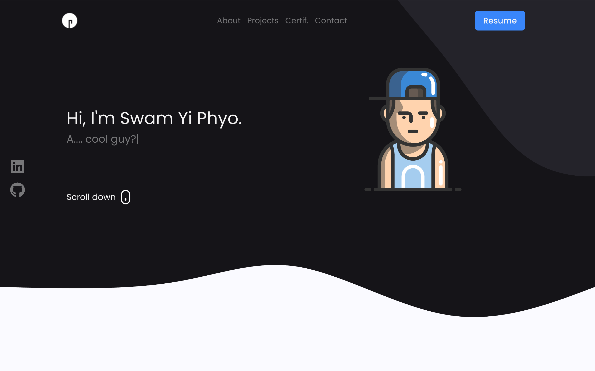

<a href="https://www.syp.dev" target="_blank" rel="noopener noreferrer">
  
</a>

## 📋 Table of Contents

- [👋 Introduction](#-introduction)
- [✨ Features](#-features)
- [🚀 Get Started](#-get-started)
- [⚖️ License](#️-license)

## 👋 Introduction
This is my personal developer portfolio built with Next.js, styled using TailwindCSS. It highlights my skills, projects, and certifications with a focus on smooth user interaction using libraries like Framer Motion, and React Type Animation.

## ✨ Features

👉 **Fully Responsive**: Works seamlessly across desktops, tablets, and mobile devices.  
👉 **Smooth Animations**: Framer Motion and React Scroll create a fluid, modern browsing experience.   
👉 **Showcase Projects**: Interactive project cards linking to live demos and code repositories.  
👉 **Certifications Display**: A dedicated section to highlight verified certifications.  
👉 **Search Functionality**: Quickly find projects or skills from the list.  
👉 **React Type Animation**: Adds dynamic text effects to draw attention and improve UX.

## 🚀 Get Started

1. **Clone the repository**

   ```bash
   git clone https://github.com/fisheeesh/portfolio_v1.git
2. **Go to your folder**
   ```bash
   cd portfolio_v1 
3. **Install Dependencies**:
   ```bash  
   npm install
4. **Run the development server**
    ```bash
    npm run dev
5. 	**Open http://localhost:3000 in your browser to see it live.**

## ⚖️ License

This project is licensed under the [MIT License](LICENSE).